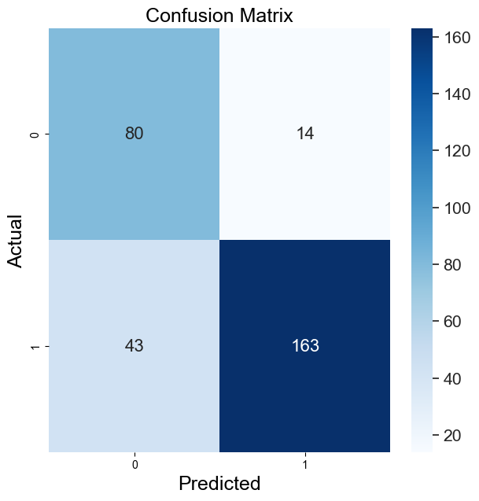
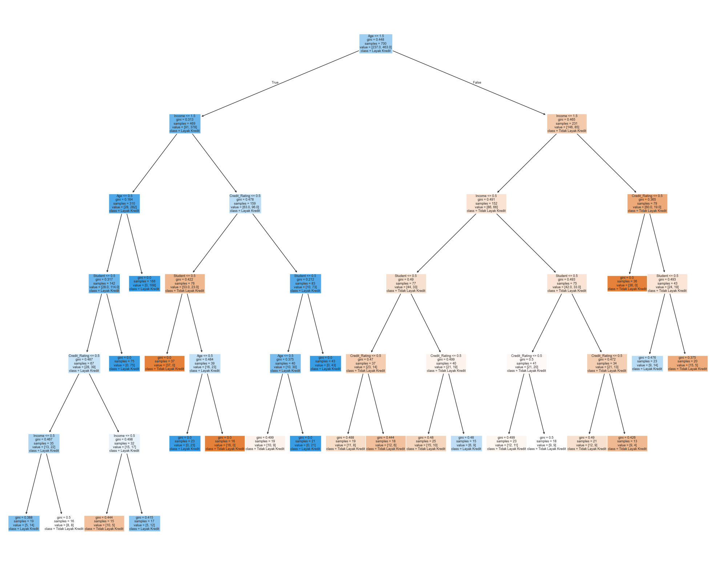

# Kredit Komputer - Klasifikasi Kelayakan Kredit (Ganjil - Decision Tree)

## Deskripsi Proyek

Proyek ini bertujuan untuk membangun model klasifikasi menggunakan decision tree yang dapat memprediksi apakah seseorang layak mendapatkan **kredit komputer** atau tidak, berdasarkan atribut-atribut demografis dan keuangan. Dataset yang digunakan berisi data dummy yang merepresentasikan kondisi nyata dalam proses pengajuan kredit komputer.

## Tahapan

- Menerapkan teknik preprocessing dan encoding terhadap data kategorikal.
- Mengevaluasi performa model menggunakan metrik evaluasi klasifikasi seperti **precision**, **recall**, dan **f1-score**.

## 🛠 Teknologi yang Digunakan

- Python
- Pandas & NumPy
- Scikit-learn (untuk preprocessing, modeling, dan evaluasi)
- Matplotlib / Seaborn (untuk visualisasi)

## Hasil Model

|            |precision  |    recall |  f1-score |   support |
|------------|-----------|-----------|-----------|-----------|
|       0    |       0.65|      0.85 |      0.74 |        94 |
|       1    |       0.92|      0.79 |      0.85 |       206 |
|            |           |           |           |           |
|accuracy    |           |           |      0.81 |       300 |

Dari hasil evaluasi, model menunjukkan performa yang cukup baik dengan akurasi keseluruhan 81%.

Dilihat dari confusion matrix nya, label 1 atau prediksi 'Layak Kredit' menunjukkan performa yang lebih baik dengan f1-score 0.85 dibanding label 0 'Tidak Layak Kredit'. Model lebih banyak memprediksi benar pada label 1 dibanding label 0.

